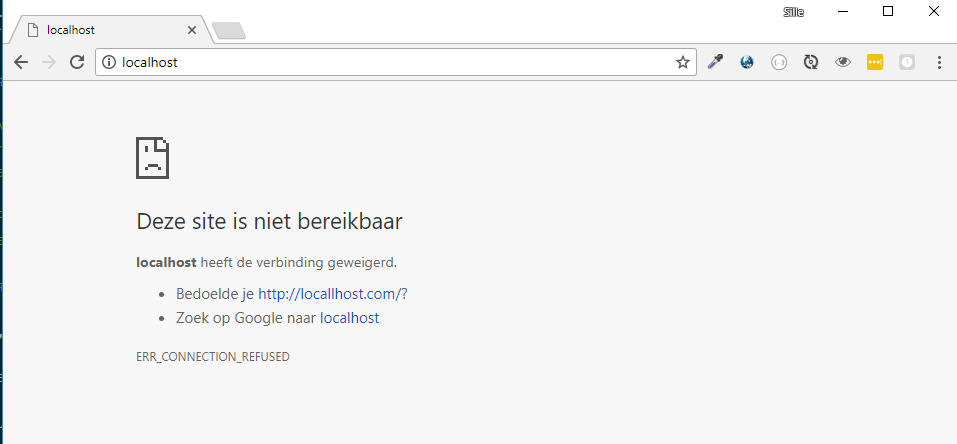
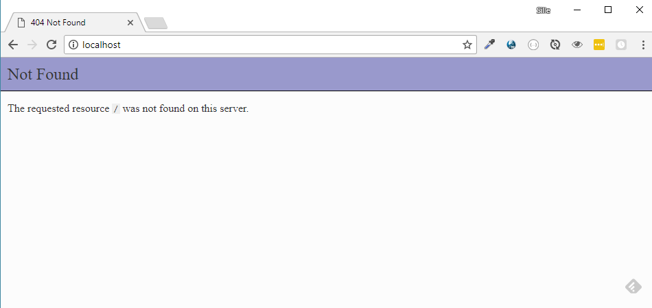
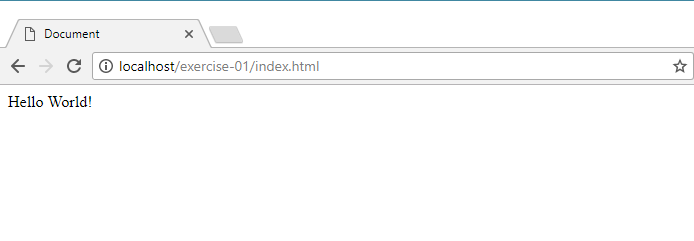
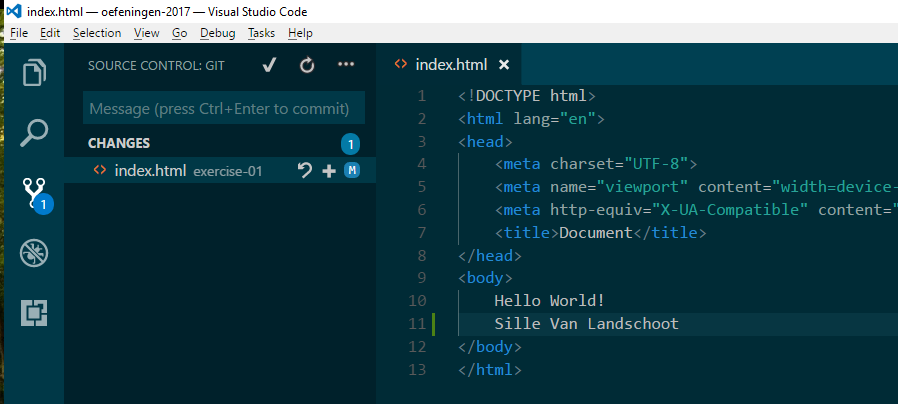
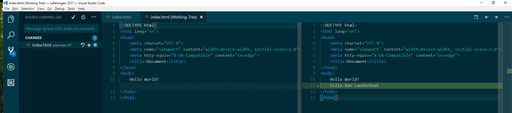
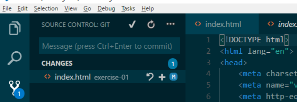
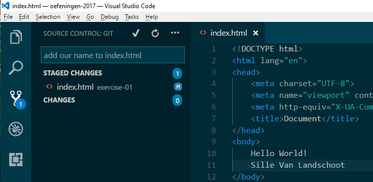
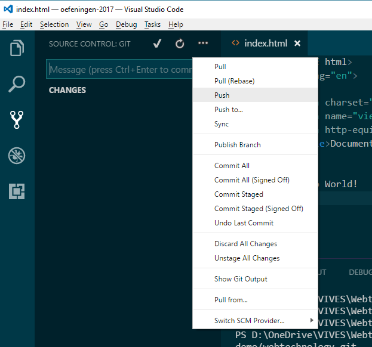

# Hello World application

Ok. Lets create our very first HTML document and get everything up and running.

## minimal Hello World document

First we need to create an `index.html` document inside this projects directory. You can do this by right-clicking the directory in the explorer window.

In this document we need to place the following code:

```html
<!DOCTYPE html>
<html lang="en">
<head>
    <meta charset="UTF-8">
    <meta name="viewport" content="width=device-width, initial-scale=1.0">
    <meta http-equiv="X-UA-Compatible" content="ie=edge">
    <title>Document</title>
</head>
<body>
    
</body>
</html>
```

Before you start typing or copy-pasting let me teach you a trick. Programmers and developers are lazy people. They will try to get the work done with the least amount of effort. The result is still the most important part. So no corners will be cut, only faster results.

Visual Studio Code supports many languages. Support for all these language is not built-in, but can be added by means of `Extensions`. So before we begin lets install the `HTML Snippets` extension. Snippets are peaces of code that can be placed in the document by using *tab completion*.

Once the `HTML Snippets` extension is installed. Visual Studio Code will now know how to type and complete HTML code for us.

In your - still empty - document, you can type `html:5` and then press the `tab` key. Visual Studio Code will type out some HTML code for you. Easy right? 

## Add something interesting

The code above is the minimal code needed to create a valid HTML document. It will show nothing more than an white empty page.

Lets add something more interesting. Lets add some text to the document.

All content that needs to be visible for the visitor of the page must be placed between the `<body>` and `</body>` tags. So lets place the text `Hello World!` between those body tags. The result will look like this:

```html
...
<body>
    Hello World!
</body>
...
```

#### HINT: Tabs and HTML

> Notice that the `Hello World!` text is indented with an tab. The sole purpose for this is to *improve* readability for the programmer. It makes it obvious that the text is IN the body of the document.
>
> Please make use of this indentation it will prevent a lot of frustration when searching for errors and bugs. It is a good practice to follow.

Don't forget to save you documents ! `control + s` should be in your fingers.

## View it in the browser

Ok, Now that we have our first document, let's view it in the browser.

Open up chrome and type in [http://localhost](http://localhost).

You should see something like this:



Did we expect to see this? What went wrong?

So we told the browser to make a **request** to localhost. Instead we got an error with the message that the connection was refused. This means that nobody or nothing was listening for the request. There is no HTTP server that could answer that request.

#### HINT: connection refused?

> Just remember that whenever you see this error that you don't have an HTTP server up and running.

## Starting the HTTP server

Earlier we installed the PHP programming language. PHP has a small built-in HTTP server embedded inside. Lets use it.

In Visual Studio Code, press the `control + ù` key. It will open up a console or terminal for us. It will load up an embedded version of Powershell where we can execute commands.

Lets type the following:

```powershell
php -S localhost:80
```

Make sure to use the uppercase `-S` or the command will not work.

This command will tel PHP to start a *server* (`-S`) that listens to localhost on port `80`. Don't panic if you don't understand all of this. This will get clear following this course. For now just remember to type this command to start a server.

Any other port can be used (1024 and up). For example, when developing port `3000` or port `8080` can be used as well.

#### HINT: Localhost?

> Whenever you surf the internet, you type in the domain name like `vives.be`. In our case we have no domain name. We have a server that runs on our computer. So how can we tell the browser to send the request to that server and not some random server somewhere on the planet? Exactly `localhost`
>
> `localhost` is known by every computer as a synonym for `itself`. So when browsing to `localhost` it will always use your own HTTP server to handle the request.
> 
> `localhost` consists out of two words... `local` and `host`. Now get it?

#### HINT: What about 127.0.0.1?

> Another way of telling your browser to use the local machine is by using the ip address `127.0.0.1`. `127.0.0.1` and `localhost` are synonyms so you can choose what ever you are happy with. The result is exactly the same.

Ok, now that our HTTP server is up and running lets reload the webpage in Chrome by pressing the `F5` key.

## 404 object not found

Ok, this is still not our webpage.



What went wrong this time?

Well we asked our browser to get the HTML document inside the root directory of `oefeningen`. This is where we executed the PHP command.

There are no HTML files inside that directory to show.

Ok, lets take the `exercise-01` directory then. This directory - if you saved your file correctly - should contain and file called `index.html`.

So lets got back to our browser and ask for the following page: [http://localhost/exercise-01/index.html](http://localhost/exercise-01/index.html)

What do we get now?



Congratulations! You just made your very first HTML document.

## Submitting your exercise (to GitHub)

### Making changes

Lets make a change in our `index.html` file and add our name in the body element. Make sure to save your file (`control + S` remember)



This tab tells us that - compared to the last time a commit was done -  one change has been made to the documents. In our case that one change is in the `index.html` file where we added our name.

#### Reviewing our change

If you click on the file in the `changes` list. Visual Studio Code will show you what changes you have made. This is handy to review you changes before you commit them.



We can see that the line we added was marked in green. If a line was deleted it will be marked in red. If a change is made it will show a red line and a green line to mark the change.

#### Undoing changes

If we made a mistake or we want to return to an older state of the project, you can reject the changes for that file. This is like an `undo` button, but for software developers. It gives us more power and functionality than an `undo` button. In git this is called *reverting* and can be done with the back arrow button next to the filename.



#### Committing a change

If you are pleased with the change and you want to save it, you need to `commit` the change so that we can send it to gitlab. 
First we need to mark the file to be committed. This is done by pressing on the `+` sign next to the filename. This is called `staging a change`. Next we need to provide a commit message and finally pres the `✓` mark on the top.

The commit message should be a short but meaningful message describing the changes we made. In this case we could type in something like: 

```text
add our name to index.html
```


Now click on the `✓` checkmark to apply the commit.

Ok, the commit is stored locally on your computer now. We still need to `push` it to the server. 

Note that Visual Studio Code tells us that there are no changes to the project.

Click on the `...` button and choose `push`. Visual Studio Code will now push the committed changes to gitlab.



When everything is done and uploaded we can review everything on the GitHub repository webpage.

We can see our latest commit message on top. And if we browse to the `index.html` file we can see its content.

## Publishing the result on Netlify

TODO: needs to be documented yet

## Assignment

Create a small resume about yourself. Clear the previous Hello World code before continueing. Try to use some other HTML elements. Google on how they work and how to use them:

* **Heading**: Add a heading containing your name
* **Multiple paragraphs**: Add some paragraphs telling something about your self.
  * Where are your from?
  * What are your previous educations?
  * Why do you want to study electronics and/or ICT?
* **Ordered or unordered lists**: List your hobbies, interests and sparetime activities
* **Images**: Add an image of yourself

## Report

At the end of the exercise, the [report](REPORT.md) file must be filled in.
